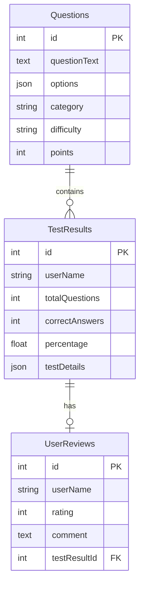

# 🎯 IELTS Mock Test Platform

<div align="center">


**Professional IELTS imtihoniga tayyorgarlik platformasi**

[Demo Ko'rish](#demo) • [O'rnatish](#ornatish) • [Xususiyatlar](#xususiyatlar) • [Dokumentatsiya](#dokumentatsiya)

</div>

---

## 📝 Loyiha Haqida

IELTS Mock Test Platform - ingliz tili bilimini sinash va IELTS imtihoniga tayyorgarlik ko'rish uchun mo'ljallangan zamonaviy veb-ilova. Platform foydalanuvchilarga real imtihon sharoitida test topshirish, natijalarini tahlil qilish va o'z bilimlarini yaxshilash imkoniyatini beradi.

### 🎯 Asosiy Maqsad

- **Talabalar uchun**: IELTS imtihoniga professional tayyorgarlik
- **O'qituvchilar uchun**: Talabalar progressini monitoring qilish
- **Ta'lim markazlari uchun**: Online test platformasi

## ✨ Xususiyatlar

### 👨‍🎓 Foydalanuvchilar Uchun
- ✅ **Online Test Topshirish** - Real vaqt rejimida test topshirish
- 📊 **Natijalar Tahlili** - Batafsil natijalar va statistika
- ⏱️ **Vaqt Boshqaruvi** - Har bir test uchun vaqt chegaralari
- 📱 **Responsive Dizayn** - Barcha qurilmalarda ishlaydi
- 🎨 **Zamonaviy UI/UX** - Intuitiv va foydalanuvchiga qulay interfeys
- 💬 **Sharh Qoldirish** - Test haqida fikr bildirish imkoniyati

### 👨‍💼 Adminlar Uchun
- 📝 **Savollar Boshqaruvi** - Savollar qo'shish, tahrirlash va o'chirish
- 📈 **Statistika Dashboard** - Umumiy statistika va tahlillar
- 👥 **Foydalanuvchilar Monitoringi** - Test natijalari va progressni kuzatish
- 💾 **Ma'lumotlar Eksporti** - Natijalarni eksport qilish
- 🔒 **Xavfsiz Admin Panel** - Himoyalangan kirish tizimi

## 🚀 Texnologiyalar

### Frontend
- **React 19.1.1** - UI komponetlar
- **Vite** - Build tool va dev server
- **Tailwind CSS** - Styling framework
- **React Router DOM** - Routing
- **Context API** - State management

### Backend
- **Node.js** - Server muhiti
- **Express.js** - Web framework
- **PostgreSQL** - Ma'lumotlar bazasi
- **Sequelize ORM** - Database ORM
- **CORS** - Cross-origin resurslar
- **dotenv** - Environment variables

## 📦 O'rnatish

### Talablar

- Node.js 14+ versiyasi
- PostgreSQL 12+
- npm yoki yarn paket menejeri

### Loyihani Klonlash

```bash
# Repository'ni klonlash
git clone https://github.com/yourusername/ielts-mock-test.git
cd ielts-mock-test
```

### Backend O'rnatish

```bash
# Backend papkasiga o'tish
cd my-backend-project

# Paketlarni o'rnatish
npm install

# Environment sozlamalarini nusxalash
cp env-example.txt .env

# .env faylini tahrirlash
# DB_HOST, DB_PORT, DB_NAME, DB_USER, DB_PASSWORD qiymatlarini o'zgartiring

# Ma'lumotlar bazasini yaratish
npm run db:sync

# Serverni ishga tushirish
npm run dev
```

### Frontend O'rnatish

```bash
# Yangi terminal oynasida
cd frontend

# Paketlarni o'rnatish
npm install

# Development serverni ishga tushirish
npm run dev
```

Ilova http://localhost:5173 manzilida ochiladi

## 🏗️ Loyiha Strukturasi

```
ielts-mock-test/
├── 📁 frontend/                # Frontend React ilovasi
│   ├── 📁 src/
│   │   ├── 📁 components/      # React komponentlar
│   │   │   ├── HomePage.jsx    # Bosh sahifa
│   │   │   ├── TestPage.jsx    # Test sahifasi
│   │   │   ├── AdminPanel.jsx  # Admin panel
│   │   │   └── ...
│   │   ├── 📁 context/         # React Context
│   │   ├── 📁 services/        # API xizmatlari
│   │   └── 📁 data/            # Static ma'lumotlar
│   └── package.json
│
└── 📁 my-backend-project/      # Backend Node.js server
    ├── 📁 config/              # Konfiguratsiyalar
    ├── 📁 models/              # Sequelize modellar
    │   ├── Question.js         # Savollar modeli
    │   ├── TestResult.js       # Test natijalari
    │   └── UserReview.js       # Foydalanuvchi sharhlari
    ├── 📁 routes/              # API marshrutlar
    ├── index.js                # Server entry point
    └── package.json
```

## 📡 API Endpoints

### Asosiy Endpoints

| Method | Endpoint | Tavsif |
|--------|----------|--------|
| GET | `/api/questions` | Barcha savollarni olish |
| POST | `/api/questions` | Yangi savol qo'shish (Admin) |
| GET | `/api/test-results` | Test natijalarini olish |
| POST | `/api/test-results` | Test natijasini saqlash |
| GET | `/api/reviews` | Sharhlarni olish |
| POST | `/api/reviews` | Yangi sharh qo'shish |

[To'liq API dokumentatsiyasi](./my-backend-project/README.md)

## 🔧 Konfiguratsiya

### Environment Variables

Backend `.env` fayli:

```env
# Database
DB_HOST=localhost
DB_PORT=5432
DB_NAME=test_system_db
DB_USER=your_username
DB_PASSWORD=your_password

# Server
NODE_ENV=development
PORT=3000
```

## 📊 Ma'lumotlar Bazasi Sxemasi



## 🚀 Deployment

### Frontend Deploy (Vercel/Netlify)

```bash
cd frontend
npm run build
# dist papkasini deploy qiling
```

### Backend Deploy (Railway/Render/Heroku)

1. PostgreSQL database yarating
2. Environment variables sozlang
3. Push to deployment platform

## 🛠️ Development

### Available Scripts

#### Frontend
- `npm run dev` - Development server
- `npm run build` - Production build
- `npm run preview` - Preview production build
- `npm run lint` - ESLint tekshiruvi

#### Backend
- `npm run dev` - Development server (nodemon)
- `npm start` - Production server
- `npm run db:sync` - Database sync

## 📈 Kelgusi Rejalar

- [ ] 🔐 JWT Authentication qo'shish
- [ ] 📧 Email xabarnomalar
- [ ] 📱 Mobile app versiyasi
- [ ] 🌍 Ko'p tillilik (i18n)
- [ ] 📊 Advanced analytics
- [ ] 🎯 AI-based savol generatsiyasi
- [ ] 💳 To'lov tizimi integratsiyasi
- [ ] 📹 Video darslar bo'limi

## 👥 Jamoa

- **Frontend Developer** - React, Tailwind CSS
- **Backend Developer** - Node.js, PostgreSQL
- **UI/UX Designer** - Interfeys dizayni

## 🤝 Hissa Qo'shish

Loyihaga hissa qo'shmoqchi bo'lsangiz:

1. Fork qiling
2. Feature branch yarating (`git checkout -b feature/NewFeature`)
3. O'zgarishlarni commit qiling (`git commit -m 'Add NewFeature'`)
4. Branch'ga push qiling (`git push origin feature/NewFeature`)
5. Pull Request oching

## 📝 Litsenziya

Bu loyiha MIT litsenziyasi ostida tarqatiladi. Batafsil ma'lumot uchun [LICENSE](LICENSE) faylini ko'ring.

## 📞 Aloqa

- **Email**: support@ieltsmocktest.uz
- **Website**: https://ieltsmocktest.uz
- **Telegram**: @ieltsmocktest

## 🙏 Minnatdorchilik

- IELTS rasmiy sahifasi
- React hamjamiyati
- Barcha open-source kutubxonalar

---

<div align="center">

**⭐ Agar loyiha yoqsa, GitHub'da yulduzcha qo'ying!**

Made with ❤️ by IELTS Mock Test Team

</div>
